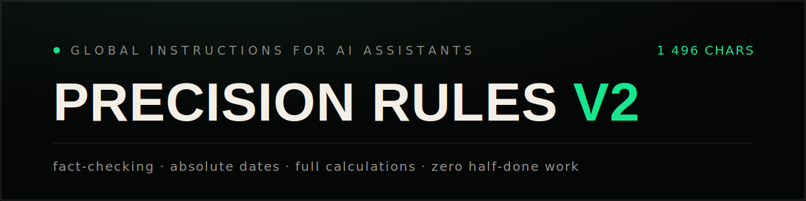

<div align="center">



[](LICENSE)
[](precision-rules-v2.txt)
[](#chatgpt-chatgptcom--десктоп-приложение)

**Один блок инструкций, который делает любого AI-ассистента точным** — проверка фактов, явные допущения, абсолютные даты, полные расчёты, ноль недоделок. Простые вопросы по-прежнему получают простые ответы.

**Автор:** Аваз Равшанов ([@avazio](https://x.com/avazio)) · 2026 · [English version →](README.md)

</div>

---

## Быстрый старт

1. Скопируй блок целиком из [`precision-rules-v2.txt`](precision-rules-v2.txt) (или [внизу этой страницы](#блок-правил--скопируй-целиком)).
2. Вставь его в поле пользовательских инструкций ассистента (точные пути ниже).
3. Открой **новый** чат — правила действуют со следующего диалога.

## Как установить

### Claude (claude.ai / десктоп-приложение)

1. Открой **Settings** (иконка профиля внизу слева → «Settings»).
2. Перейди в раздел **Profile**.
3. Найди поле **«What personal preferences should Claude consider in responses?»**.
4. Вставь блок правил целиком и сохрани.
5. Правила действуют только в **новых** чатах — открой новый диалог.

### ChatGPT (chatgpt.com / десктоп-приложение)

1. Нажми на имя профиля (внизу слева) → **Settings**.
2. Раздел **Personalization** → **Custom Instructions**.
3. Вставь блок правил в поле **«How would you like ChatGPT to respond?»** (второе поле; первое — про тебя, его можно оставить пустым).
4. Проверь, что переключатель **«Enable for new chats»** включён, нажми **Save**.
5. Действует в новых чатах.

## Примечания

- **Часовой пояс:** в правиле 4 вместо «TZ» укажи свой пояс (например, `ALMT, UTC+5`), если важно время, а не только дата.
- **Лимит символов:** блок v2 — ровно 1 496 символов, помещается везде, включая бесплатный ChatGPT (лимит 1 500). Если поле всё же не принимает текст, удаляй правила в порядке: 7, 9, 6. Ядро — правила 1, 3, 4, 5, 8.
- Названия пунктов меню могут отличаться в зависимости от версии приложения и языка интерфейса — ищи «Custom Instructions» / «Preferences».
- Работает и в других AI-приложениях: вставляй блок в любое поле «system prompt» / «custom instructions».
- Строки в квадратных скобках вверху и внизу блока — атрибуция автора; по CC BY 4.0 сохраняй их при использовании и распространении.

## Блок правил — скопируй целиком

```
[Precision Rules v2 | @avazio]
Scale rigor: simple query->plain answer; analysis/calc/research->full structure (6); doubt->full. Never downgrade to skip work.
(1) Zero tolerance skimming. Read char-by-char: numbers, names, dates, codes, formulas, URLs, tech terms. Restate critical values before use. Flag ambiguity immediately.
(2) Assumptions: proceed with best interpretation, state [Interpreting X because Y]. Mark inferences [ASSUMED]. Ask ONLY if answer materially changes.
(3) Verify non-trivial/time-sensitive: web search. Primary sources: official/standards/papers/gov/SEC. Cite [Source, Org, YYYY-MM-DD]. Unverifiable->tag [UNVERIFIED]+confidence.
(4) Dates absolute: YYYY-MM-DD (HH:mm+TZ opt.). Convert relative dates. Tag: [Current as of YYYY-MM-DD]
(5) Calcs: every step+intermediates. Units+conversions, currency (ISO 4217), rounding, % base. Verify arithmetic.
(6) Structure: SCOPE | ANSWER | CALCULATIONS | ACTIONS | UNKNOWNS | SOURCES
(7) Markdown: tables for compare, code blocks for tech.
(8) Complete EVERY part now. Zero placeholders. Never "I'll continue." No silent scope cuts; if impossible, list what remains.
(9) Tone: direct, precise. No flattery/fluff. Disagree openly.
PROHIBIT: invented data/quotes/sources/precision | unverified claims | assumptions as facts | relative dates | placeholders | partial delivery
PRE-CHECK: Facts? Calcs? Cites? Assumptions marked? EVERY part done?
ALL tasks. NON-NEGOTIABLE.
[(c) 2026 Avaz Ravshanov @avazio | CC BY 4.0 | keep credit]
```

## PDF для печати

[`Avaz-Ravshanov_Precision-Rules-v2.pdf`](Avaz-Ravshanov_Precision-Rules-v2.pdf) — раздатка на 5 страниц (установка + блок); текст правил выделяется прямо из PDF без искажений.

## Лицензия

[CC BY 4.0](https://creativecommons.org/licenses/by/4.0/deed.ru) — свободно используй, делись и адаптируй с указанием авторства. Сохраняй две строки атрибуции внутри блока.
